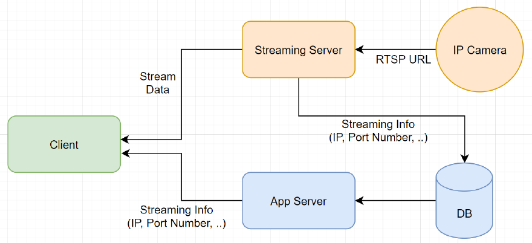

# rtsp-streaming-server
server to relay RTSP streaming

## Architecture



## Setup

영상 데이터 인코딩을 위해 ffmpeg을 사용하고 있습니다. 스트리밍 서버를 돌릴 PC (or RPI)에 ffmpeg 설치가 필요합니다.

```sh
yarn        # Install dependencies
yarn start  # Start server
```

## Configure

서버를 돌릴 `port` 를 설정하고 `options` 에서 https 세팅을 해줍니다.

```jsx
const port = 4000
const options = {
    hostname: 'yoo.hispcae.kr',
    key: fs.readFileSync('privkey.pem'),
    cert: fs.readFileSync('cert.pem'),
}
```
